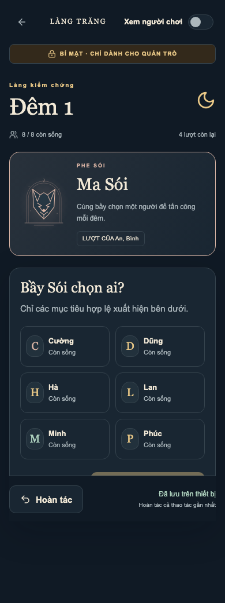
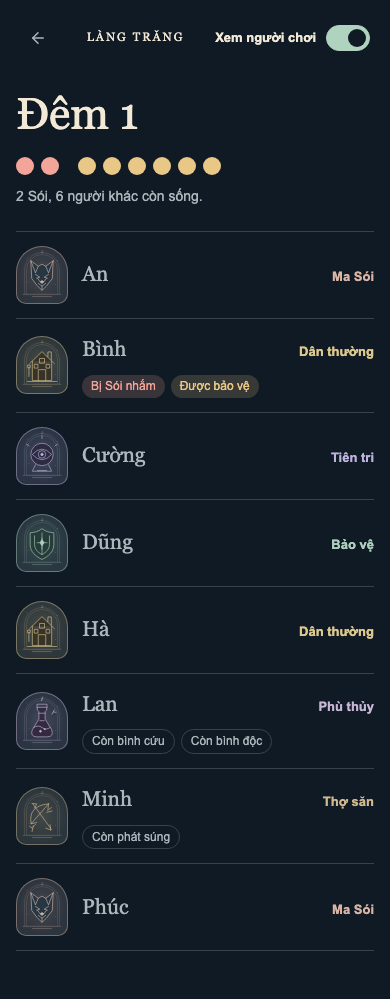

# Audit MVP — 27/09/2026

Phạm vi: implementation thật từ repository trống; engine, event log, persistence, gameplay, public privacy, story và offline. Dùng production static export trong Chromium Playwright. Không có Browser connector trong môi trường; ảnh dưới đây được chụp từ app đang chạy bằng browser test trong repository.

## Luồng đã kiểm tra

| Bước | Trạng thái | Bằng chứng |
|---|---|---|
| 1. Trang chủ, tạo ván | Pass | [Trang chủ](screenshots/01-home-390.png) |
| 2. Thêm 8 người, chọn bộ vai, gán tay và review kín | Pass | [Review vai](screenshots/02-review-390.png) |
| 3. Đêm 1: chọn, Undo, bảo vệ, soi và giữ bình | Pass | [Điều hành đêm](screenshots/03-night-390.png) |
| 4. Sáng, thảo luận, chọn người bị nghi ngờ, thanh minh, treo cổ | Pass | [Sáng ngày 1](screenshots/04-morning-390.png), [Thanh minh](screenshots/08-trial-360.png) |
| 5. Đêm 2, poison, victory, confirm, story/reveal/stats/history | Pass | [Tổng kết](screenshots/05-ending-390.png), [Lật bài](screenshots/09-reveal-390.png), assertions trong E2E |
| 6. Layout ở 360/390/430/768/1280 px | Pass, không horizontal overflow | [360](screenshots/06-gameplay-360.png), [390](screenshots/06-gameplay-390.png), [430](screenshots/06-gameplay-430.png), [tablet](screenshots/06-gameplay-768.png), [desktop](screenshots/06-gameplay-1280.png) |
| 7. Xem người chơi → refresh → vẫn mở; công tắc một chạm về màn hình điều hành | Pass | [Xem người chơi](screenshots/07-roster-390.png), DOM assertions |
| 8. Offline reload, đóng tab, restart browser thật | Pass | Playwright restart dùng persistent profile rồi mở lại offline |
| 9. Wizard refresh ngay sau Thêm người | Pass | Test regression riêng cho write-ahead draft |

## Những lỗi đã sửa

- **Offline navigation bị browser từ chối:** `/index.html` được static server redirect. Dùng cached root `/` cho navigation; xác minh reload cả online/offline và browser restart.
- **Public mode mất sau refresh:** lưu cờ hiển thị ở sessionStorage; xác nhận mới mở bí mật. Test bảo đảm public DOM không có role/secret badge.
- **Bản nháp bị mất khi reload ngay:** IndexedDB write có thể chưa chạy xong; thêm synchronous draft journal và mirror vào IndexedDB. Game log vẫn luôn nằm trong IndexedDB.
- **Tên token bị screen reader đọc hai lần:** avatar chữ cái được đánh dấu trang trí `aria-hidden`.
- **Stat phiếu sửa bị đếm trùng:** chỉ tính phiếu cuối theo `(round, voterId)`.
- **Player story thiếu người được cứu/Sói thứ hai:** metadata action chứa healed target và toàn bộ bầy Sói sống.
- **Không nói rõ vì sao tránh đòn cắn:** ghi `WOLF_ATTACK_BLOCKED` với đúng nguồn guard/heal, ngay cả khi nạn nhân sau đó chết vì độc.
- **Timeline của death đã undo có thể lỗi nếu player bị xóa khi quay về setup:** renderer xử lý player không còn trong danh sách, không crash.
- **Role rules bị lặp giữa UI/engine:** kết quả soi và điều kiện cứu nằm trong `roles/abilities.ts`; NightTurn dùng cùng functions.
- **Safari báo `crypto.randomUUID is not a function`:** thay các chỗ tạo ID bằng UUID v4 có fallback `getRandomValues()`. Unit tests, browser test giả lập thiếu API và kiểm tra HTTP LAN insecure context đều pass.

## Mô phỏng hoàn chỉnh đã xác minh

Làng 8 người: An/Bình là Sói, Cường Bảo vệ, Dũng Tiên tri, Hà Phù thủy, Lan Thợ săn, Minh/Phúc Dân thường.

1. Đêm 1: Sói chọn Minh; thử Undo rồi chọn lại. Cường bảo vệ Minh. Dũng soi An → Sói. Hà giữ bình. Không ai chết.
2. Ngày 1: cả 8 người vote An. An chết do `VOTE_EXECUTION`.
3. Đêm 2: Bình chọn Phúc. Cường không được bảo vệ Minh liên tiếp, chọn Cường. Dũng soi Bình → Sói. Hà dùng độc lên Bình.
4. Phúc chết do `WOLF_ATTACK`; Bình chết do `WITCH_POISON`. Dân đạt điều kiện thắng, chưa tự chuyển summary.
5. Quản trò xác nhận kết thúc. Verify story đúng các nguyên nhân, đủ 8 role reveal, thống kê protection, undo marker, history và reload summary.

Test domain độc lập còn mô phỏng Hunter bị vote tại ngưỡng Sói thắng: chưa xét thắng cho đến khi Hunter bắn; Hunter giết Sói cuối → Dân thắng.

## UX / visual / accessibility

- Nền đêm navy, ngày nâu ấm, nhãn bí mật vàng; public có nhãn xanh rõ và không render dữ liệu bí mật.
- Role cards có illustration riêng; dead có chữ và biểu tượng, selection có viền và check, không chỉ dựa vào màu.
- Nút chính và Undo luôn dễ nhận biết; gameplay dùng Undo sticky. Với danh sách nhiều người, vẫn cần cuộn để đến mọi mục tiêu.
- Artwork local, không che text; độ rộng desktop được giới hạn để không kéo giãn bàn điều khiển.
- Kiểm tra tự động không horizontal overflow tại năm kích thước. Keyboard có focus rõ; native dialog khóa focus khi xác nhận.
- axe-core WCAG A/AA: không violation trên Home, gameplay và Public trong tập kiểm tra. Không thay thế kiểm tra với VoiceOver/TalkBack và người dùng thật.

## Giới hạn bằng chứng

Các screenshots là ảnh chụp trong lượt kiểm tra hiện tại, đã mở và xem. E2E kiểm tra chức năng, không chỉ ảnh. Chưa thử native install trên điện thoại thật, Safari thật hoặc mạng chập chờn ở thiết bị yếu. WebKit Playwright trên macOS hiện tại không tạo được page do lỗi giao thức `PushAPIEnabled`; thử nghiệm qua HTTP LAN bằng Chromium đã xác minh chính xác tình huống `randomUUID` vắng mặt. Chưa có thử nghiệm usability trực tiếp với một bàn chơi thật.

## Ảnh đại diện

